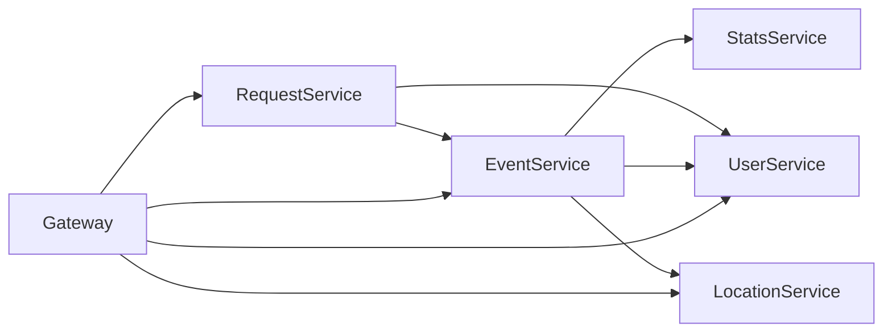
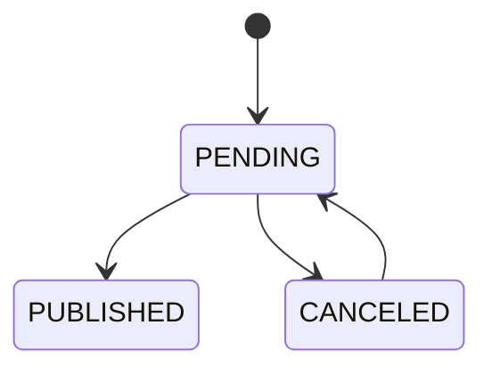
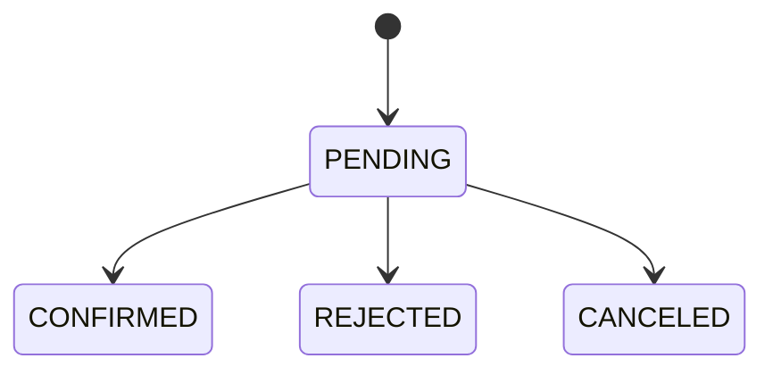

# ExploreWithMe

## 📌 Описание проекта

**ExploreWithMe** — Java/Spring-приложение для публикации, поиска и посещения событий.

Пользователи могут:
- просматривать публичную афишу событий;
- искать события по фильтрам;
- создавать собственные события;
- подавать заявки на участие;
- управлять заявками на свои события.

Администраторы могут:
- управлять пользователями;
- создавать и редактировать категории;
- формировать подборки событий;
- модерировать события.

Дополнительно используется отдельный сервис статистики.

---

## 🧱 Архитектура



---

## 🧩 Модули проекта

```text
explore-with-me/
├── infra/
│   ├── config-server/
│   ├── discovery-server/
│   └── gateway-server/
│
├── core/
│   ├── main-service/
│   ├── event-service/
│   ├── request-service/
│   ├── user-service/
│   └── location-service/
│
├── stats/
│   ├── stats-server/
│   ├── stats-client/
│   └── stats-dto/
```

---

## ⚙️ Технологии

- Java 21
- Spring Boot
- Spring Data JPA
- PostgreSQL
- Docker
- Spring Cloud (Eureka, Gateway, Config)
- OpenFeign
- Lombok

---

## 🔗 Взаимодействие сервисов

- `event-service` → `stats-server`
- `event-service` → `user-service`
- `event-service` → `location-service`
- `request-service` → `event-service`
- `request-service` → `user-service`

---

## 🌍 API Gateway

```text
http://localhost:8080
```

---

## 📊 Жизненный цикл события



---

## 📬 Статусы заявок



---

## 🗄️ Хранение данных

| Сервис             | схема      |
|--------------------|------------|
| event-service      | event      |
| request-service    | request    |
| user-service       | user       |
| stats-server       | stats      |
| location-service   | location   |

---

## 🚀 Запуск

```bash
mvn clean package
docker-compose up
```

---

## 📌 Итог

- микросервисная архитектура
- API Gateway как единая точка входа
- Eureka для discovery
- Config Server для конфигурации
- независимые сервисы