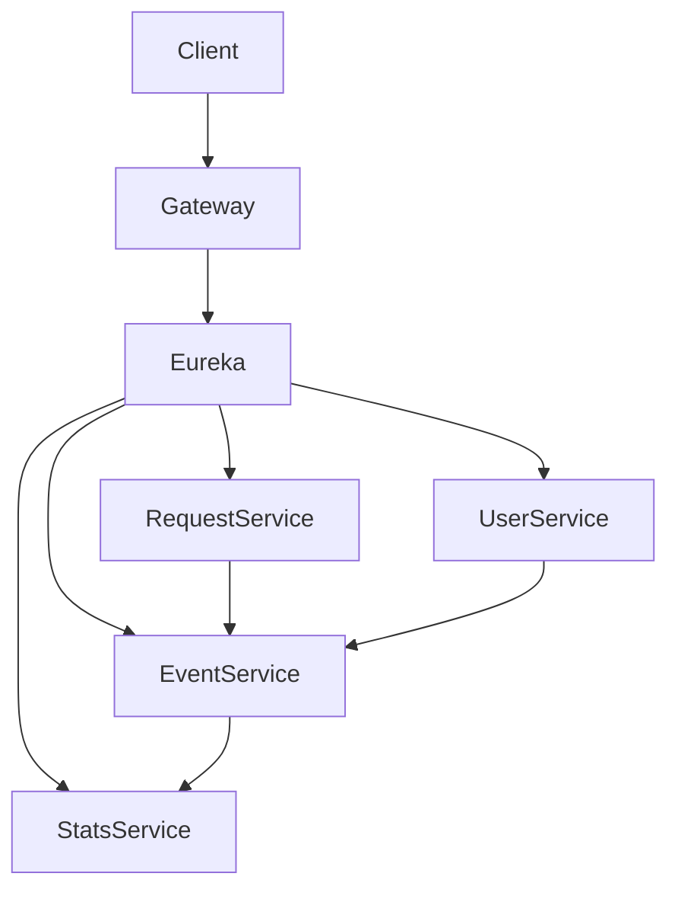
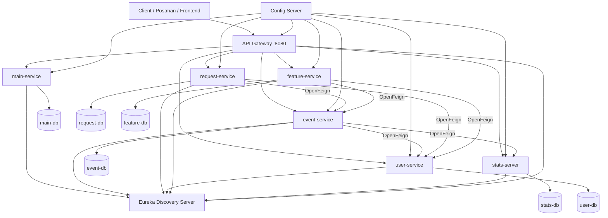
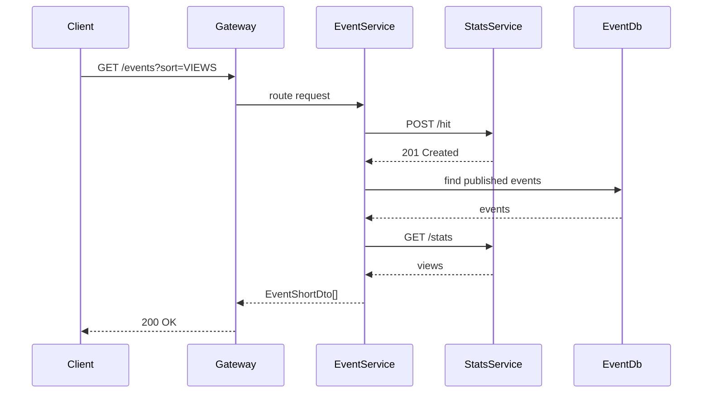
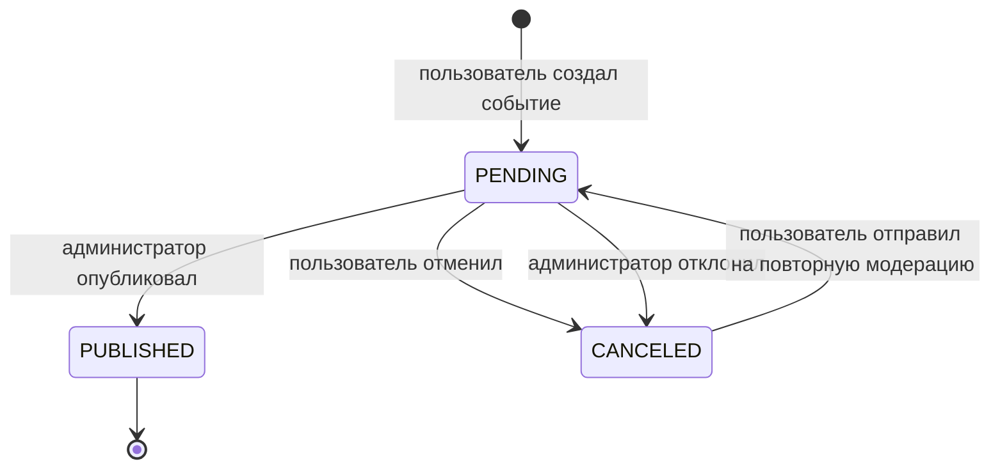
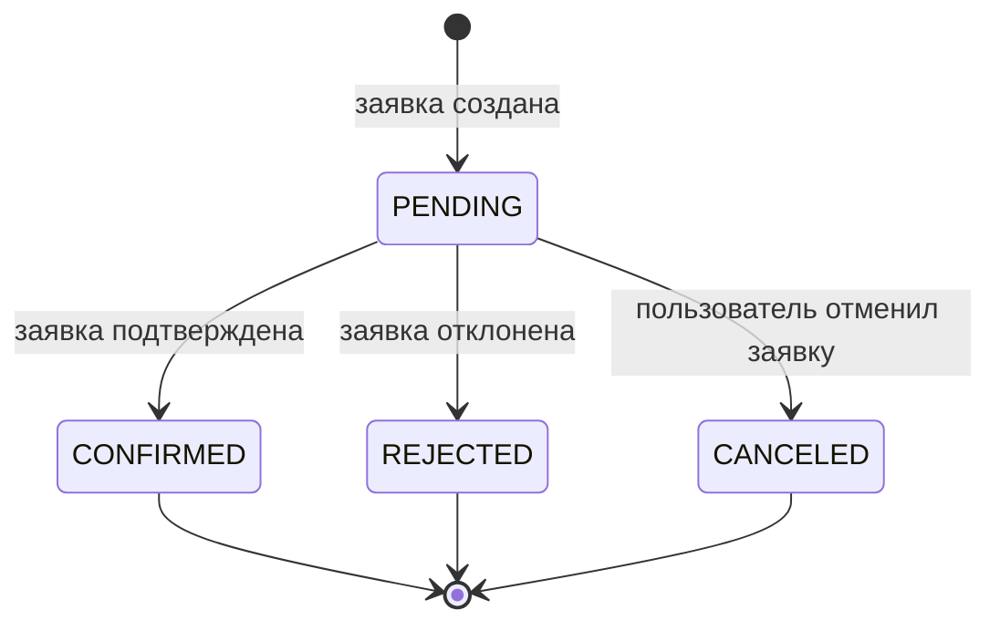

# 📌 ExploreWithMe

## 📖 Описание
ExploreWithMe — микросервисное приложение-афиша для создания, поиска и участия в событиях.

---

## 🏗 Архитектура

### Infra:
- config-server
- discovery-server (Eureka)
- gateway-server

### Core:
- event-service
- request-service
- user-service
- stats-service
- feature-service

---

## 🔗 Диаграмма архитектуры



---

## ⚙️ Конфигурация
Все конфигурации хранятся в config-server.

---

## 🔌 Внутренний API
Взаимодействие через OpenFeign.

---

## 🌐 Внешний API
- Публичный
- Приватный
- Административный

Спецификации:
- ewm-main-service-spec.json
- ewm-stats-service.json

---

## 🗄 Базы данных
Каждый сервис использует отдельную PostgreSQL базу.

---

## 🐳 Запуск

```bash
docker-compose up
```

---

## 📌 Итог
Проект переведен на микросервисную архитектуру для повышения масштабируемости и устойчивости.

# ExploreWithMe

## Описание проекта

**ExploreWithMe** — Java/Spring-приложение для публикации, поиска и посещения событий.

Пользователи могут:
- просматривать публичную афишу событий;
- искать события по фильтрам;
- создавать собственные события;
- подавать заявки на участие;
- управлять заявками на свои события.

Администраторы могут:
- управлять пользователями;
- создавать и редактировать категории;
- формировать подборки событий;
- модерировать события.

Дополнительно в проекте есть отдельный **сервис статистики**, который фиксирует обращения к публичным эндпоинтам и возвращает количество просмотров.

---

## Технологический стек

- Java 17
- Spring Boot
- Spring Web
- Spring Data JPA
- PostgreSQL
- Maven
- Docker
- Docker Compose
- Spring Cloud Config
- Spring Cloud Netflix Eureka
- Spring Cloud Gateway
- OpenFeign
- Lombok
- Postman

---

## Архитектура

Проект подготовлен к микросервисной архитектуре и разделён на инфраструктурные и бизнес-модули.

```text
explore-with-me/
├── infra/
│   ├── config-server/
│   ├── discovery-server/
│   └── gateway-server/
│
├── core/
│   ├── main-service/
│   ├── event-service/
│   ├── request-service/
│   ├── user-service/
│   └── feature-service/
│
├── stats/
│   ├── stats-server/
│   ├── stats-client/
│   └── stats-dto/
│
├── postman/
│   └── feature.json
│
├── docker-compose.yml
└── pom.xml
```

> Если фактические имена модулей отличаются, README можно быстро адаптировать под текущую структуру проекта.

---

## Инфраструктурные сервисы

### config-server

Сервис централизованной конфигурации.

Назначение:
- хранит настройки всех сервисов;
- позволяет не дублировать конфигурацию в каждом модуле;
- упрощает изменение параметров окружения;
- выдаёт конфигурации сервисам при запуске.

Пример расположения конфигураций:

```text
infra/config-server/src/main/resources/config/
├── gateway-server.yml
├── main-service.yml
├── stats-server.yml
├── event-service.yml
├── request-service.yml
└── user-service.yml
```

### discovery-server

Сервис обнаружения на базе **Eureka**.

Назначение:
- регистрирует запущенные сервисы;
- позволяет сервисам находить друг друга по имени приложения;
- избавляет от жёстко заданных портов;
- упрощает масштабирование нескольких экземпляров одного сервиса.

### gateway-server

API-шлюз на базе **Spring Cloud Gateway**.

Назначение:
- является единой точкой входа;
- принимает внешние HTTP-запросы;
- маршрутизирует запросы в нужные сервисы;
- скрывает внутреннюю структуру микросервисов.

Внешний порт gateway:

```text
8080
```

---

## Бизнес-сервисы

### main-service

Основной сервис приложения. На ранних этапах содержит бизнес-логику монолита. По мере перехода к микросервисам функциональность выносится в отдельные сервисы.

### event-service

Сервис управления событиями.

Отвечает за:
- создание события;
- редактирование события;
- поиск событий;
- получение подробной информации;
- публикацию и отклонение событий;
- связь события с категорией, инициатором и локацией;
- получение просмотров из stats-service.

### request-service

Сервис заявок на участие.

Отвечает за:
- создание заявки;
- отмену заявки;
- просмотр заявок пользователя;
- подтверждение и отклонение заявок инициатором события;
- проверку лимитов участников.

### user-service

Сервис управления пользователями.

Отвечает за:
- создание пользователя;
- получение списка пользователей;
- удаление пользователя;
- предоставление данных пользователя другим сервисам.

### stats-server

Сервис статистики.

Отвечает за:
- сохранение факта обращения к эндпоинту;
- получение количества просмотров;
- подсчёт уникальных посещений по IP;
- предоставление статистики основному сервису.

### feature-service

Сервис дополнительной функциональности.

В зависимости от выбранной фичи может отвечать за:
- комментарии к событиям;
- подписки на пользователей;
- рейтинги событий;
- локации;
- расширенную модерацию.

---

## Диаграмма архитектуры



---

## Пример обработки публичного запроса



---

## Взаимодействие сервисов

Для внутреннего взаимодействия используется **OpenFeign**.

Основные принципы:
- сервисы обращаются друг к другу по имени приложения из Eureka;
- прямые адреса и порты не используются;
- внешнее API отделено от внутреннего API;
- DTO для межсервисного взаимодействия вынесены в отдельные пакеты/модули;
- количество запросов между сервисами должно быть фиксированным, чтобы избежать проблемы N+1.

Примеры связей:

```text
event-service   -> stats-server
event-service   -> user-service
request-service -> event-service
request-service -> user-service
feature-service -> event-service
feature-service -> user-service
```

---

# Внешний API основного сервиса

Базовый URL:

```text
http://localhost:8080
```

API разделено на три части:
- публичное API;
- приватное API пользователя;
- административное API.

---

## Публичное API

Публичные эндпоинты доступны без авторизации.

### События

| Метод | URL | Назначение |
|---|---|---|
| `GET` | `/events` | Получение опубликованных событий с фильтрацией |
| `GET` | `/events/{id}` | Получение подробной информации об опубликованном событии |

#### GET /events

Позволяет получить список опубликованных событий.

Параметры:

| Параметр | Тип | Обязательный | Описание |
|---|---|---:|---|
| `text` | `string` | нет | Поиск по аннотации и описанию |
| `categories` | `array[long]` | нет | ID категорий |
| `paid` | `boolean` | нет | Только платные/бесплатные события |
| `rangeStart` | `string` | нет | Начало диапазона даты события |
| `rangeEnd` | `string` | нет | Конец диапазона даты события |
| `onlyAvailable` | `boolean` | нет | Только события с доступными местами |
| `sort` | `string` | нет | `EVENT_DATE` или `VIEWS` |
| `from` | `int` | нет | Сколько элементов пропустить |
| `size` | `int` | нет | Размер страницы |

Особенности:
- возвращаются только опубликованные события;
- поиск по тексту выполняется без учёта регистра;
- если даты не переданы, возвращаются будущие события;
- каждый запрос фиксируется в stats-service;
- ответ содержит количество просмотров и подтверждённых заявок.

Пример:

```http
GET /events?text=concert&paid=true&sort=VIEWS&from=0&size=10
```

#### GET /events/{id}

Возвращает полную информацию об опубликованном событии.

Особенности:
- событие должно быть опубликовано;
- запрос фиксируется в stats-service;
- ответ содержит просмотры и количество подтверждённых заявок.

---

### Категории

| Метод | URL | Назначение |
|---|---|---|
| `GET` | `/categories` | Получение списка категорий |
| `GET` | `/categories/{catId}` | Получение категории по ID |

Параметры `/categories`:

| Параметр | Тип | Значение по умолчанию |
|---|---|---|
| `from` | `int` | `0` |
| `size` | `int` | `10` |

---

### Подборки событий

| Метод | URL | Назначение |
|---|---|---|
| `GET` | `/compilations` | Получение подборок событий |
| `GET` | `/compilations/{compId}` | Получение подборки по ID |

Параметры `/compilations`:

| Параметр | Тип | Обязательный | Описание |
|---|---|---:|---|
| `pinned` | `boolean` | нет | Искать только закреплённые или незакреплённые подборки |
| `from` | `int` | нет | Сколько элементов пропустить |
| `size` | `int` | нет | Размер страницы |

---

## Приватное API пользователя

Приватное API предназначено для работы текущего пользователя со своими событиями и заявками.

### События пользователя

| Метод | URL | Назначение |
|---|---|---|
| `GET` | `/users/{userId}/events` | Получение событий пользователя |
| `POST` | `/users/{userId}/events` | Добавление нового события |
| `GET` | `/users/{userId}/events/{eventId}` | Получение полной информации о своём событии |
| `PATCH` | `/users/{userId}/events/{eventId}` | Изменение своего события |
| `GET` | `/users/{userId}/events/{eventId}/requests` | Получение заявок на своё событие |
| `PATCH` | `/users/{userId}/events/{eventId}/requests` | Подтверждение или отклонение заявок |

#### POST /users/{userId}/events

Создаёт новое событие.

Важные правила:
- дата события должна быть не раньше чем через два часа от текущего момента;
- после создания событие получает статус `PENDING`;
- событие ожидает модерации администратором.

Пример тела запроса:

```json
{
  "annotation": "Сплав на байдарках похож на полет.",
  "category": 2,
  "description": "Сплав на байдарках похож на полет. На спокойной воде — это парение.",
  "eventDate": "2024-12-31 15:10:05",
  "location": {
    "lat": 55.754167,
    "lon": 37.62
  },
  "paid": true,
  "participantLimit": 10,
  "requestModeration": true,
  "title": "Сплав на байдарках"
}
```

#### PATCH /users/{userId}/events/{eventId}

Изменяет событие, созданное текущим пользователем.

Важные правила:
- можно менять только отменённые события или события в ожидании модерации;
- дата события должна быть не раньше чем через два часа от текущего момента;
- пользователь может отправить событие на повторную модерацию или отменить рассмотрение.

`stateAction`:
- `SEND_TO_REVIEW`
- `CANCEL_REVIEW`

---

### Заявки пользователя

| Метод | URL | Назначение |
|---|---|---|
| `GET` | `/users/{userId}/requests` | Получение заявок пользователя |
| `POST` | `/users/{userId}/requests?eventId={eventId}` | Создание заявки на участие |
| `PATCH` | `/users/{userId}/requests/{requestId}/cancel` | Отмена своей заявки |

#### POST /users/{userId}/requests

Создаёт заявку на участие в событии.

Важные правила:
- нельзя создать повторную заявку;
- инициатор события не может подать заявку на своё событие;
- нельзя участвовать в неопубликованном событии;
- нельзя подать заявку, если лимит участников исчерпан;
- если премодерация отключена, заявка автоматически получает статус `CONFIRMED`;
- если премодерация включена, заявка получает статус `PENDING`.

---

## Административное API

Административное API предназначено для управления данными сервиса.

### Пользователи

| Метод | URL | Назначение |
|---|---|---|
| `GET` | `/admin/users` | Получение пользователей |
| `POST` | `/admin/users` | Добавление пользователя |
| `DELETE` | `/admin/users/{userId}` | Удаление пользователя |

#### POST /admin/users

Пример тела запроса:

```json
{
  "name": "Иван Петров",
  "email": "ivan.petrov@practicummail.ru"
}
```

---

### Категории

| Метод | URL | Назначение |
|---|---|---|
| `POST` | `/admin/categories` | Добавление категории |
| `PATCH` | `/admin/categories/{catId}` | Изменение категории |
| `DELETE` | `/admin/categories/{catId}` | Удаление категории |

Важные правила:
- имя категории должно быть уникальным;
- нельзя удалить категорию, если с ней связано хотя бы одно событие.

---

### Подборки событий

| Метод | URL | Назначение |
|---|---|---|
| `POST` | `/admin/compilations` | Добавление подборки |
| `PATCH` | `/admin/compilations/{compId}` | Обновление подборки |
| `DELETE` | `/admin/compilations/{compId}` | Удаление подборки |

Подборка может быть пустой и может быть закреплена на главной странице.

Пример тела запроса:

```json
{
  "events": [1, 2, 3],
  "pinned": true,
  "title": "Летние концерты"
}
```

---

### События

| Метод | URL | Назначение |
|---|---|---|
| `GET` | `/admin/events` | Административный поиск событий |
| `PATCH` | `/admin/events/{eventId}` | Редактирование события и изменение статуса |

#### GET /admin/events

Параметры:

| Параметр | Тип | Описание |
|---|---|---|
| `users` | `array[long]` | ID пользователей-инициаторов |
| `states` | `array[string]` | Состояния событий |
| `categories` | `array[long]` | ID категорий |
| `rangeStart` | `string` | Начало диапазона |
| `rangeEnd` | `string` | Конец диапазона |
| `from` | `int` | Сколько элементов пропустить |
| `size` | `int` | Размер страницы |

#### PATCH /admin/events/{eventId}

Администратор может редактировать данные события и менять статус.

`stateAction`:
- `PUBLISH_EVENT`
- `REJECT_EVENT`

Важные правила:
- публиковать можно только событие в статусе `PENDING`;
- отклонить можно только событие, которое ещё не опубликовано;
- дата начала события должна быть не ранее чем за час от даты публикации.

---

# Stats service API

Базовый URL:

```text
http://localhost:9090
```

Сервис статистики содержит два эндпоинта:

| Метод | URL | Назначение |
|---|---|---|
| `POST` | `/hit` | Сохранение информации о запросе |
| `GET` | `/stats` | Получение статистики посещений |

---

## POST /hit

Сохраняет информацию о том, что пользователь обратился к определённому URI конкретного сервиса.

### Request

```http
POST /hit
Content-Type: application/json
```

### Body

```json
{
  "app": "ewm-main-service",
  "uri": "/events/1",
  "ip": "192.163.0.1",
  "timestamp": "2022-09-06 11:00:23"
}
```

### EndpointHit

| Поле | Тип | Описание |
|---|---|---|
| `id` | `long` | Идентификатор записи, генерируется сервером |
| `app` | `string` | Имя сервиса |
| `uri` | `string` | URI, к которому был выполнен запрос |
| `ip` | `string` | IP-адрес пользователя |
| `timestamp` | `string` | Дата и время запроса в формате `yyyy-MM-dd HH:mm:ss` |

### Response

```http
201 Created
```

---

## GET /stats

Возвращает статистику посещений за выбранный период.

### Query parameters

| Параметр | Тип | Обязательный | Описание |
|---|---|---:|---|
| `start` | `string` | да | Начало периода в формате `yyyy-MM-dd HH:mm:ss` |
| `end` | `string` | да | Конец периода в формате `yyyy-MM-dd HH:mm:ss` |
| `uris` | `array[string]` | нет | Список URI |
| `unique` | `boolean` | нет | Учитывать только уникальные IP |

> Значения `start` и `end` нужно URL-кодировать, потому что они содержат пробелы и двоеточия.

### Request example

```http
GET /stats?start=2022-09-01%2000%3A00%3A00&end=2022-09-10%2023%3A59%3A59&uris=/events/1&unique=true
```

### Response body

```json
[
  {
    "app": "ewm-main-service",
    "uri": "/events/1",
    "hits": 6
  }
]
```

### ViewStats

| Поле | Тип | Описание |
|---|---|---|
| `app` | `string` | Название сервиса |
| `uri` | `string` | URI сервиса |
| `hits` | `long` | Количество просмотров |

---

## Feign-клиент статистики

```java
@FeignClient(name = "stats-server")
public interface StatsClient {

    @PostMapping("/hit")
    void saveHit(@RequestBody EndpointHitDto endpointHitDto);

    @GetMapping("/stats")
    List<ViewStatsDto> getStats(
            @RequestParam("start") String start,
            @RequestParam("end") String end,
            @RequestParam(value = "uris", required = false) List<String> uris,
            @RequestParam(value = "unique", defaultValue = "false") Boolean unique
    );
}
```

---

## Основные DTO

### EventShortDto

Краткая информация о событии.

Содержит:
- `id`;
- `title`;
- `annotation`;
- `category`;
- `paid`;
- `eventDate`;
- `initiator`;
- `confirmedRequests`;
- `views`.

### EventFullDto

Полная информация о событии.

Дополнительно содержит:
- `description`;
- `createdOn`;
- `publishedOn`;
- `location`;
- `participantLimit`;
- `requestModeration`;
- `state`.

### NewEventDto

DTO для создания события.

Обязательные поля:
- `annotation`;
- `category`;
- `description`;
- `eventDate`;
- `location`;
- `title`.

Ограничения:
- `annotation`: от 20 до 2000 символов;
- `description`: от 20 до 7000 символов;
- `title`: от 3 до 120 символов;
- дата события должна быть в будущем.

### UserDto

Пользователь.

Поля:
- `id`;
- `name`;
- `email`.

### CategoryDto

Категория события.

Поля:
- `id`;
- `name`.

### CompilationDto

Подборка событий.

Поля:
- `id`;
- `title`;
- `pinned`;
- `events`.

### ParticipationRequestDto

Заявка на участие.

Поля:
- `id`;
- `created`;
- `event`;
- `requester`;
- `status`.

### ApiError

Единый формат ошибки.

Поля:
- `errors`;
- `message`;
- `reason`;
- `status`;
- `timestamp`.

---

## Жизненный цикл события



Состояния события:
- `PENDING` — ожидает публикации;
- `PUBLISHED` — опубликовано;
- `CANCELED` — отменено или отклонено.

---

## Статусы заявок на участие



---

## Правила обработки ошибок

Типовые HTTP-коды:

| Код | Значение |
|---|---|
| `200 OK` | Запрос успешно обработан |
| `201 Created` | Ресурс создан |
| `204 No Content` | Ресурс удалён |
| `400 Bad Request` | Некорректный запрос |
| `404 Not Found` | Ресурс не найден |
| `409 Conflict` | Нарушение бизнес-правила или ограничений |

Пример ошибки:

```json
{
  "status": "CONFLICT",
  "reason": "For the requested operation the conditions are not met.",
  "message": "Only pending or canceled events can be changed",
  "timestamp": "2022-09-07 09:10:50"
}
```

---

## Хранение данных

Каждый сервис владеет своими данными.

| Сервис | База данных | Назначение |
|---|---|---|
| `main-service` | `main-db` | Основные данные монолита |
| `event-service` | `event-db` | События, категории, подборки |
| `request-service` | `request-db` | Заявки на участие |
| `user-service` | `user-db` | Пользователи |
| `stats-server` | `stats-db` | Статистика просмотров |
| `feature-service` | `feature-db` | Дополнительная функциональность |

Преимущества такого подхода:
- сервисы меньше зависят друг от друга;
- проще масштабировать отдельные части системы;
- сбой одного сервиса не обязан останавливать всё приложение;
- проще переносить функциональность из монолита в микросервисы.

---

## Запуск проекта

### Требования

- Java 17+
- Maven
- Docker
- Docker Compose

### Сборка

```bash
mvn clean package
```

### Запуск через Docker Compose

```bash
docker-compose up
```

### Остановка

```bash
docker-compose down
```

---

## Проверка работоспособности

После запуска можно проверить:

```text
GET http://localhost:8080/categories
GET http://localhost:8080/events
GET http://localhost:9090/stats?start=2022-09-01%2000%3A00%3A00&end=2022-09-10%2023%3A59%3A59
```

Если используется Eureka:

```text
http://localhost:<eureka-port>
```

---

## Postman

Для дополнительной функциональности используется коллекция:

```text
postman/feature.json
```

Коллекция должна проверять:
- успешные сценарии;
- ошибки валидации;
- ошибки бизнес-правил;
- коды ответов API.

---

## Что было сделано при переходе к микросервисам

1. Проект разделён на группирующие Maven-модули.
2. Добавлен инфраструктурный модуль `infra`.
3. Добавлены:
    - Config Server;
    - Eureka Discovery Server;
    - API Gateway.
4. Основной сервис подготовлен к выносу бизнес-логики.
5. Выделены логические границы сервисов:
    - события;
    - заявки;
    - пользователи;
    - статистика;
    - дополнительная функциональность.
6. Прямые вызовы между модулями заменяются Feign-клиентами.
7. Gateway настроен как единая точка входа.
8. Конфигурации сервисов вынесены в Config Server.

---

## Итог

Проект подготовлен к работе в облачной и микросервисной среде.

Результат:
- единая точка входа через Gateway;
- динамическое обнаружение сервисов через Eureka;
- централизованная конфигурация через Config Server;
- независимое масштабирование сервисов;
- отдельный сервис статистики;
- понятное разделение ответственности между модулями.
